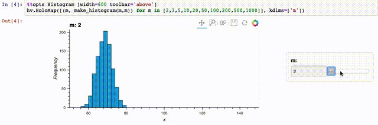

# Throttler Demo 
This project is a simple example of a python implementation of a message throttler.

## Quickstart
You should have a unix-type machine (e.g. OSX, Linux) and `python3` on your path.

* `make demo` to see sample output
* `make test` to run unit tests
* `make run_notebooks` to run the visualization demo

## Implementation
The implementation is in [throttle.py](src/throttler/throttle.py).  It is a somewhat naive implementation using 
the native python [deque](https://docs.python.org/3/library/collections.html#collections.deque) class.  This is somewhat
performant, but obviously a custom class optimized for this tiny use case could be much faster.  

## Developing with PyCharm
After running `make test`, 
you should be able to open up the top-level directory in [PyCharm](https://www.jetbrains.com/pycharm/) right away.
The following run configurations are available:

* `harness` : run the command-line harness (with default input)
* `Unit tests` : run unit tests 

## Visualization Demo
There is a sample [Jupyter](https://jupyter.org/) notebook [here](notebooks/throttle_and_bandwidth_demo.ipynb).
To run it: `make run_notebooks`.

You should be able to get a histogram slider like this one:

